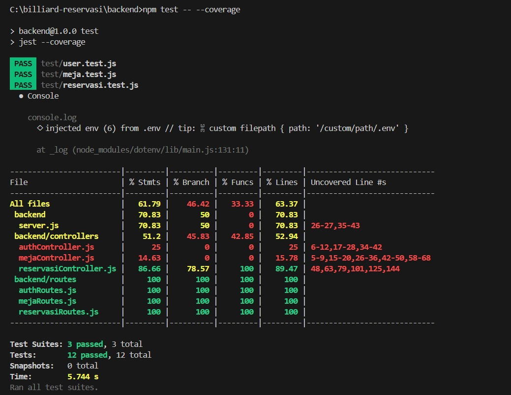
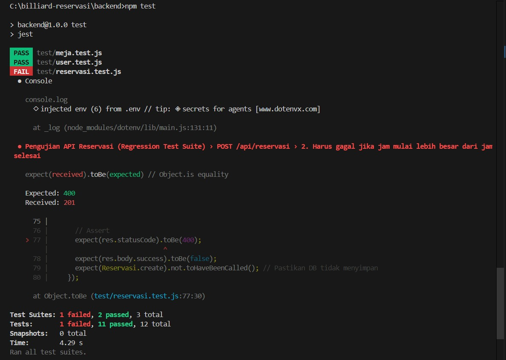

# Tugas Regression Test Suite - API BilliardPro

Repositori ini berisi pengerjaan tugas individu untuk implementasi Regression Test Suite menggunakan Jest dan Supertest pada REST API reservasi BilliardPro. 

---

## Cara Menjalankan Test
1. Masuk ke direktori `backend` melalui terminal.
2. Jalankan `npm install` untuk mengunduh semua dependencies.
3. Ketik `npm test` untuk mengeksekusi seluruh pengujian.
4. Ketik `npm test -- --coverage` untuk melihat laporan persentase *code coverage*.

---

## 1. Skenario & Kualitas Test Case
Terdapat **10 test case** yang disusun khusus untuk menguji fungsionalitas modul Reservasi (`/api/reservasi`). Pengujian ini sudah mencakup jalur normal (*happy path*) dan skenario gagal (*error scenario*) seperti pencegahan input jam yang tidak valid atau jadwal meja yang bentrok. Setiap blok pengujian ditulis secara terstruktur menggunakan pola **AAA (Arrange, Act, Assert)** agar kode lebih mudah dibaca.

---

## 2. Hasil Code Coverage

**Analisis Singkat:**
Dari hasil eksekusi Jest, *line coverage* khusus untuk file logika `reservasiController.js` telah mencapai **89.47%**. Angka ini sudah melampaui standar minimal 75% yang disyaratkan. Hampir seluruh percabangan logika bisnis telah berhasil dilalui oleh *test suite*.

---

## 3. Demonstrasi Deteksi Regresi

**Pembuktian:**
Gambar di atas adalah bukti bahwa *test suite* ini benar-benar berfungsi menangkap *bug* atau ketidaksengajaan. Ketika blok kode validasi waktu pada *controller* sengaja saya matikan sementara, *test suite* langsung bereaksi dan menggagalkan pengujian (**FAIL**). Setelah kodenya diperbaiki seperti semula, seluruh test kembali hijau (**PASS**). Ini membuktikan bahwa fungsionalitas API sudah terlindungi dari perubahan yang merusak.